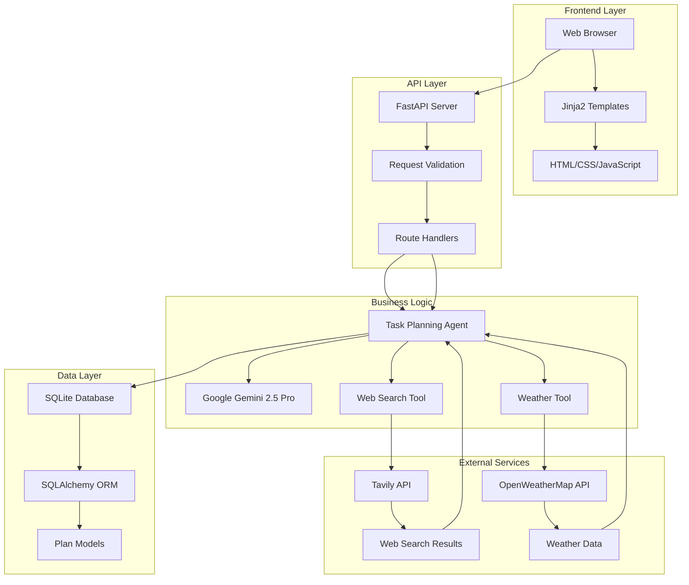

# Task Planner Agent 🚀

**A smart, AI-powered agent that creates detailed, actionable plans for any goal, from learning a new skill to planning a vacation.**

---

[](https://www.python.org/downloads/)
[](https://fastapi.tiangolo.com/)
[](https://railway.app/)

**Live Demo:** [https://task-planner-agent-production.up.railway.app/](https://task-planner-agent-production.up.railway.app/)

---

## Overview

Task Planner Agent is a full-stack web application built with Python and FastAPI that leverages Google's Gemini AI to function as an intelligent task planner. Users can input a high-level goal, and the agent will generate a structured, day-by-day plan, enriched with real-time web search and weather data.

The agent is versatile—capable of creating everything from technical learning roadmaps to detailed travel itineraries. It intelligently decides when to use external tools like Tavily (web search) and OpenWeatherMap (weather) to enrich its plans.

---

## Key Features

- **Intelligent AI Agent:** Uses a "two-pass" thinking process to select the right tools and generate informed plans.
- **Dynamic AI Personas:** Easily modify the agent's instructions to make it an expert in any domain (travel, fitness, career, etc.).
- **Tool Integration:** Seamlessly integrates with Tavily (web search) and OpenWeatherMap (weather) for fact-based, relevant plans.
- **Full-Stack Application:** Robust FastAPI backend and clean, responsive HTML/Jinja2 frontend.
- **Database Persistence:** Saves all generated plans to a database (SQLite locally, PostgreSQL in production).
- **CI/CD Pipeline:** Deployed on Railway with continuous deployment from GitHub.

---

## Example Plans

### 1. Learning Roadmap

**Goal:** Make a Roadmap to Learn Data Science in 6 months

**Generated Plan:**
```json
{
  "goal": "Make a Roadmap to Learn Data Science in 6 months",
  "overview": "A comprehensive 6-month roadmap progressing from fundamentals to advanced projects.",
  "estimated_duration": "6 months",
  "daily_breakdown": [
    {
      "day": 1,
      "focus": "Month 1: Python & Math",
      "tasks": [
        {
          "task": "Complete a Python fundamentals course",
          "estimated_time": "3 weeks",
          "priority": "high"
        },
        {
          "task": "Review Linear Algebra and Statistics basics",
          "estimated_time": "1 week",
          "priority": "high"
        }
      ]
    },
    {
      "day": 61,
      "focus": "Month 3: Machine Learning",
      "tasks": [
        {
          "task": "Learn supervised vs unsupervised learning with Scikit-learn",
          "estimated_time": "4 weeks",
          "priority": "high"
        }
      ]
    }
  ],
  "success_metrics": [
    "2 end-to-end projects",
    "Portfolio site with projects",
    "Core ML understanding"
  ],
  "potential_challenges": [
    "Finding good datasets",
    "Motivation dips",
    "Overwhelming scope"
  ]
}
```


### 2. Travel Itinerary

**Goal:** Plan a 4-day photography trip to London next week

**Generated Plan:**
```json
{
  
  "goal": "Plan a 4-day photography trip to London",
  "overview": "Photography-focused itinerary covering landmarks, hidden gems, and street life.",
  "estimated_duration": "4 days",
  "daily_breakdown": [
    {
      "day": 1,
      "focus": "Iconic Landmarks",
      "tasks": [
        {
          "task": "Shoot St. Paul’s Cathedral from Millennium Bridge",
          "estimated_time": "3 hours",
          "priority": "high"
        }
      ]
    }
  ],
  "success_metrics": [
    "20 portfolio-quality images",
    "5 iconic landmarks"
  ],
  "potential_challenges": [
    "London weather",
    "Tourist crowds"
  ]
}
```

## Architecture Diagram


##  Technology Stack

- **Backend:** Python 3.12.10
- **Framework:** Flask (API compatible with FastAPI)
- **AI:** Google Gemini AI API
- **Deployment:** Railway (asia-southeast1 region)
- **WSGI Server:** Gunicorn with Uvicorn workers
- **Process Management:** Procfile


## 🛠️ Setup Instructions

### 1. Clone the Repository

```bash
git clone <repository-url>
cd task-planner-agent
```

### 2. Create Virtual Environment

```bash
# Create virtual environment
python -m venv venv

# Activate virtual environment
# On Windows:
venv\Scripts\activate
# On macOS/Linux:
source venv/bin/activate
```

### 3. Install Dependencies

```bash
pip install -r requirements.txt
```

### 4. Environment Configuration

Create a `.env` file in the project root:

```env
# Required API Keys
GEMINI_API_KEY=your_gemini_api_key_here
TAVILY_API_KEY=your_tavily_api_key_here
OPENWEATHER_API_KEY=your_openweather_api_key_here

# Optional Configuration
DATABASE_URL=sqlite:///./task_planner.db
HOST=0.0.0.0
PORT=8000
```

### 5. Get API Keys

#### Google Gemini API
1. Visit [Google AI Studio](https://makersuite.google.com/app/apikey)
2. Sign in with your Google account
3. Create a new API key
4. Copy the key to your `.env` file

#### Tavily API (Web Search)
1. Visit [Tavily](https://tavily.com/)
2. Sign up for an account
3. Get your API key from the dashboard
4. Copy the key to your `.env` file

#### OpenWeatherMap API (Weather)
1. Visit [OpenWeatherMap](https://openweathermap.org/api)
2. Sign up for a free account
3. Generate an API key
4. Copy the key to your `.env` file

### 6. Run the Application

```bash
python main.py
```
The application will be available at `http://localhost:8000`

## AI Usage Disclosure
This project was developed with help from GitHub Copilot and other AI tools for:
Initial scaffolding & boilerplate
API integrations (Gemini, Tavily, Weather)
Error handling templates
Documentation drafts
All code was reviewed, tested, and customized for project needs.
