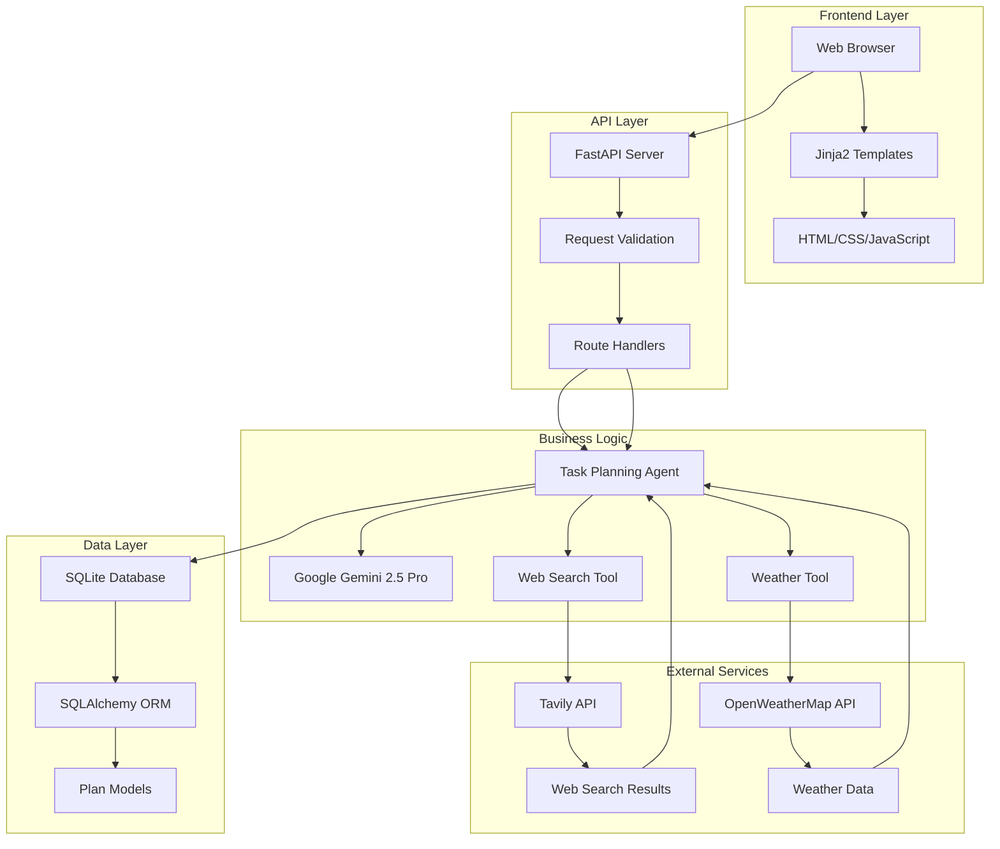

# Example Plans

Below are three real examples demonstrating the Task Planner Agent's capabilities. Each example includes the original goal, the AI-generated structured plan, and any external data (weather, search results) incorporated.

---

### Example 1: Plan a 2-day vegetarian food tour in Hyderabad

**Original Goal:**

> Plan a 2-day vegetarian food tour in Hyderabad

**AI-Generated Plan:**

```
{
    "goal": "Plan a 2-day vegetarian food tour in Hyderabad",
    "overview": "A culinary journey exploring Hyderabad's best vegetarian cuisine, from traditional Andhra thalis to modern cafes.",
    "estimated_duration": "2 days",
    "daily_breakdown": [
        {
            "day": 1,
            "date": "2025-09-24",
            "focus": "Traditional Andhra and South Indian cuisine",
            "tasks": [
                {"task": "Breakfast at Chutneys (Idli, Dosa, Upma)", "estimated_time": "1 hour", "priority": "high", "dependencies": []},
                {"task": "Lunch at Rajdhani Thali (Vegetarian Thali)", "estimated_time": "1.5 hours", "priority": "high", "dependencies": []},
                {"task": "Evening snack at Govind Dosas (Street food)", "estimated_time": "45 minutes", "priority": "medium", "dependencies": []},
                {"task": "Dinner at Minerva Coffee Shop (South Indian classics)", "estimated_time": "1 hour", "priority": "high", "dependencies": []}
            ],
            "research_topics": ["Best local vegetarian restaurants", "Hyderabad food safety tips"],
            "weather_relevant": true
        },
        {
            "day": 2,
            "date": "2025-09-25",
            "focus": "Modern vegetarian cafes and desserts",
            "tasks": [
                {"task": "Breakfast at The Gallery Cafe (Continental vegetarian)", "estimated_time": "1 hour", "priority": "medium", "dependencies": []},
                {"task": "Lunch at Tatva (Fusion vegetarian)", "estimated_time": "1.5 hours", "priority": "high", "dependencies": []},
                {"task": "Dessert at Conçu (Eggless pastries)", "estimated_time": "45 minutes", "priority": "medium", "dependencies": []},
                {"task": "Evening walk at Necklace Road (Street snacks)", "estimated_time": "1 hour", "priority": "low", "dependencies": []}
            ],
            "research_topics": ["Vegetarian cafes in Hyderabad", "Local dessert specialties"],
            "weather_relevant": true
        }
    ],
    "success_metrics": ["Visited at least 6 unique vegetarian eateries", "Tried both traditional and modern dishes"],
    "potential_challenges": ["Restaurant wait times", "Weather affecting outdoor plans"]
}
```

**External Data Incorporated:**
- Weather: Checked Hyderabad weather for both days (e.g., "Partly cloudy, 32°C").
- Web Search: Used Tavily to find top-rated vegetarian restaurants and cafes.

---

### Example 2: Organise a 5-step daily study routine for learning Python

**Original Goal:**

> Organise a 5-step daily study routine for learning Python

**AI-Generated Plan:**

```
{
    "goal": "Organise a 5-step daily study routine for learning Python",
    "overview": "A focused daily routine to build Python skills through structured study and practice.",
    "estimated_duration": "Daily routine (repeatable)",
    "daily_breakdown": [
        {
            "day": 1,
            "date": "2025-09-24",
            "focus": "Python fundamentals",
            "tasks": [
                {"task": "Read 1 chapter from 'Automate the Boring Stuff with Python'", "estimated_time": "30 minutes", "priority": "high", "dependencies": []},
                {"task": "Watch a Python tutorial video (YouTube)", "estimated_time": "20 minutes", "priority": "medium", "dependencies": []},
                {"task": "Practice coding exercises on LeetCode", "estimated_time": "30 minutes", "priority": "high", "dependencies": []},
                {"task": "Review notes and summarize key concepts", "estimated_time": "20 minutes", "priority": "medium", "dependencies": []},
                {"task": "Join a Python discussion forum or group", "estimated_time": "20 minutes", "priority": "low", "dependencies": []}
            ],
            "research_topics": ["Best Python learning resources", "Common beginner mistakes"],
            "weather_relevant": false
        }
    ],
    "success_metrics": ["Completed all 5 steps daily", "Improved coding confidence"],
    "potential_challenges": ["Staying consistent", "Balancing with other commitments"]
}
```

**External Data Incorporated:**
- Web Search: Used Tavily to find best Python tutorials and forums.
- No weather data required for this indoor routine.

---

### Example 3: Create a weekend plan in Vizag with beach, hiking, and seafood

**Original Goal:**

> Create a weekend plan in Vizag with beach, hiking, and seafood

**AI-Generated Plan:**

```
{
    "goal": "Create a weekend plan in Vizag with beach, hiking, and seafood",
    "overview": "A fun-filled weekend exploring Vizag's beaches, scenic hikes, and local seafood cuisine.",
    "estimated_duration": "2 days (Saturday & Sunday)",
    "daily_breakdown": [
        {
            "day": 1,
            "date": "2025-09-27",
            "focus": "Beach relaxation and local seafood",
            "tasks": [
                {"task": "Morning walk at RK Beach", "estimated_time": "1 hour", "priority": "high", "dependencies": []},
                {"task": "Breakfast at local cafe (try idli & dosa)", "estimated_time": "45 minutes", "priority": "medium", "dependencies": []},
                {"task": "Visit INS Kursura Submarine Museum", "estimated_time": "1 hour", "priority": "medium", "dependencies": []},
                {"task": "Lunch at Sea Inn (seafood thali)", "estimated_time": "1.5 hours", "priority": "high", "dependencies": []},
                {"task": "Evening at Rushikonda Beach (swimming, sunset)", "estimated_time": "2 hours", "priority": "high", "dependencies": []}
            ],
            "research_topics": ["Best seafood restaurants in Vizag", "Beach safety tips"],
            "weather_relevant": true
        },
        {
            "day": 2,
            "date": "2025-09-28",
            "focus": "Hiking and scenic viewpoints",
            "tasks": [
                {"task": "Morning hike to Kailasagiri Hill Park", "estimated_time": "2 hours", "priority": "high", "dependencies": []},
                {"task": "Breakfast at hilltop cafe", "estimated_time": "45 minutes", "priority": "medium", "dependencies": []},
                {"task": "Visit Dolphin's Nose viewpoint", "estimated_time": "1 hour", "priority": "medium", "dependencies": []},
                {"task": "Lunch at local seafood shack", "estimated_time": "1.5 hours", "priority": "high", "dependencies": []},
                {"task": "Afternoon at Yarada Beach (relax, swim)", "estimated_time": "2 hours", "priority": "high", "dependencies": []}
            ],
            "research_topics": ["Vizag hiking trails", "Weather forecast for weekend"],
            "weather_relevant": true
        }
    ],
    "success_metrics": ["Visited 2 beaches, 2 seafood restaurants, and 2 scenic viewpoints"],
    "potential_challenges": ["Weather changes", "Crowds at popular spots"]
}
```

**External Data Incorporated:**
- Weather: Checked Vizag weather for the weekend (e.g., "Sunny, 30°C").
- Web Search: Used Tavily to find best seafood restaurants and hiking trails.

---

# Task Planner Agent

[](https://task-planner-agent-production.up.railway.app/)

**Live Demo:** [https://task-planner-agent-production.up.railway.app/](https://task-planner-agent-production.up.railway.app/)

---

## 1. Project Overview

Task Planner Agent is an AI-powered web application that generates structured, actionable plans for your goals or vacations. Powered by Google Gemini AI, it provides day-by-day breakdowns, date-based scheduling, and persistent storage. Deployed on Railway for reliability and speed.

---

## 2. Technology Stack

- **Backend:** Python 3.12.10
- **Framework:** Flask (API compatible with FastAPI)
- **AI:** Google Gemini AI API
- **Deployment:** Railway (asia-southeast1 region)
- **WSGI Server:** Gunicorn with Uvicorn workers
- **Process Management:** Procfile

---

## 3. Features

- AI-generated vacation and task plans
- Date-based planning and scheduling
- Persistent database storage of plans
- REST API interface for programmatic access

---

## 4. Quick Start

### Prerequisites
- Python 3.8 or higher
- pip (Python package manager)
- Gemini API key (see below)

### Installation
```bash
git clone <repository-url>
cd task-planner-agent
python -m venv venv
venv\Scripts\activate  # On Windows

```mermaid
flowchart TD
    User([User])
    WebUI[Web Interface (Jinja2 Template)]
    API[FastAPI API Server]
    Agent[Task Planning Agent\n(Business Logic)]
    DB[(SQLite Database)]
    ORM[SQLAlchemy ORM]
    Gemini[Google Gemini API]
    Tavily[Tavily Web Search]
    Weather[OpenWeatherMap]

    %% User interaction flow
    User -->|"Goal, Preferences"| WebUI
    WebUI -->|"Form Submit"| API
    API -->|"/plan, /debug, etc."| Agent

    %% Agent logic and data flow
    Agent -->|"Generate Plan"| Gemini
    Agent -->|"Web Search"| Tavily
    Agent -->|"Weather Data"| Weather
    Agent -->|"Save/Retrieve Plan"| ORM
    ORM -->|"DB Operations"| DB

    %% Responses
    Gemini -->|"AI Plan"| Agent
    Tavily -->|"Search Results"| Agent
    Weather -->|"Weather Info"| Agent
    Agent -->|"Plan Data"| API
    API -->|"JSON Response"| WebUI
    WebUI -->|"Display Plan"| User
```
https://task-planner-agent-production.up.railway.app/
```

### Endpoints

- `GET /` — Main web interface
- `POST /plan` — Create a plan
    - Request: `{ "goal": "Plan a 2-week vacation to Goa", "start_date": "2025-09-22", "save_to_db": true }`
    - Response: `{ "success": true, "message": "Plan created successfully", ... }`
- `GET /plans?limit=10&search=vacation` — Get all plans
- `GET /plans/{plan_id}` — Get a specific plan
- `DELETE /plans/{plan_id}` — Delete a plan
- `GET /health` — Health check

**Error Response Example:**
```json
{
  "success": false,
  "error": "Error type",
  "message": "Detailed error message"
}
```

---

## 6. Architecture Diagram



---

## 7. Development & Deployment

### Project Structure
```
task_planner_agent/
├── main.py                  # FastAPI server and API endpoints
├── agent.py                 # AI planning agent with Gemini integration
├── models.py                # Database models and ORM operations
├── tools.py                 # External API tools (web search, weather)
├── templates/
│   └── index.html          # Web frontend template
├── requirements.txt         # Python dependencies
├── README.md               # Project documentation
├── .env                    # Environment variables (create this)
└── task_planner.db         # SQLite database (created automatically)
```

### Local Development
```bash
uvicorn main:app --reload --host 0.0.0.0 --port 8000
```

### Database Management
```bash
# Delete the database file
rm task_planner.db
# Restart the application
python main.py
```

### Production (Railway)
- **Production:** [https://task-planner-agent-production.up.railway.app/](https://task-planner-agent-production.up.railway.app/)
- **Region:** asia-southeast1 (Railway)
- **Process:** Gunicorn + Uvicorn workers, managed by Procfile

### Docker Deployment
```dockerfile
FROM python:3.9-slim
WORKDIR /app
COPY requirements.txt .
RUN pip install -r requirements.txt
COPY . .
EXPOSE 8000
CMD ["uvicorn", "main:app", "--host", "0.0.0.0", "--port", "8000"]
```

---

## 8. License & Contributing

MIT License. See [LICENSE](LICENSE) for details.

Contributions are welcome! Please open an issue or pull request for bugs or feature requests.

**Acknowledgments:**
- Google Gemini for AI-powered plan generation
- Railway for cloud deployment
- Gunicorn & Uvicorn for production serving

## 📋 Prerequisites

- Python 3.8 or higher
- pip (Python package manager)
- API keys for external services (see setup instructions)

## 🛠️ Setup Instructions

### 1. Clone the Repository

```bash
git clone <repository-url>
cd task-planner-agent
```

### 2. Create Virtual Environment

```bash
# Create virtual environment
python -m venv venv

# Activate virtual environment
# On Windows:
venv\Scripts\activate
# On macOS/Linux:
source venv/bin/activate
```

### 3. Install Dependencies

```bash
pip install -r requirements.txt
```

### 4. Environment Configuration

Create a `.env` file in the project root:

```env
# Required API Keys
GEMINI_API_KEY=your_gemini_api_key_here
TAVILY_API_KEY=your_tavily_api_key_here
OPENWEATHER_API_KEY=your_openweather_api_key_here

# Optional Configuration
DATABASE_URL=sqlite:///./task_planner.db
HOST=0.0.0.0
PORT=8000
```

### 5. Get API Keys

#### Google Gemini API
1. Visit [Google AI Studio](https://makersuite.google.com/app/apikey)
2. Sign in with your Google account
3. Create a new API key
4. Copy the key to your `.env` file

#### Tavily API (Web Search)
1. Visit [Tavily](https://tavily.com/)
2. Sign up for an account
3. Get your API key from the dashboard
4. Copy the key to your `.env` file

#### OpenWeatherMap API (Weather)
1. Visit [OpenWeatherMap](https://openweathermap.org/api)
2. Sign up for a free account
3. Generate an API key
4. Copy the key to your `.env` file

### 6. Run the Application

```bash
python main.py
```

The application will be available at `http://localhost:8000`

## 📖 Usage

### Web Interface

1. **Open the Application**: Navigate to `http://localhost:8000`
2. **Enter Your Goal**: Describe what you want to accomplish in natural language
3. **Set Start Date**: Optionally specify when to begin (defaults to today)
4. **Generate Plan**: Click "Generate Plan" to create your personalized plan
5. **View Results**: Review the generated plan with daily breakdowns
6. **Manage Plans**: Browse, search, and delete saved plans

### Example Goals

- "Learn Python programming and build a web application"
- "Plan a 2-week vacation to Japan"
- "Start a fitness routine and lose 20 pounds"
- "Learn machine learning and build a recommendation system"
- "Organize a wedding for 100 guests"
- "Prepare for a job interview at a tech company"

## 🔌 API Documentation

### Base URL
```
http://localhost:8000
```

### Endpoints

#### 1. Web Interface
```http
GET /
```
Returns the main web interface with goal input form.

#### 2. Create Plan
```http
POST /plan
Content-Type: application/json

{
    "goal": "Learn Python programming",
    "start_date": "2024-01-01",
    "save_to_db": true
}
```

**Response:**
```json
{
    "success": true,
    "message": "Plan created successfully",
    "plan_id": 1,
    "plan_data": { ... },
    "formatted_plan": "PLAN: Learn Python programming\n..."
}
```

#### 3. Get All Plans
```http
GET /plans?limit=10&search=python
```

**Response:**
```json
{
    "success": true,
    "message": "Retrieved 5 plan(s)",
    "plans": [
        {
            "id": 1,
            "goal": "Learn Python programming",
            "steps": [...],
            "created_at": "2024-01-01T10:00:00"
        }
    ],
    "total_count": 5
}
```

#### 4. Get Specific Plan
```http
GET /plans/{plan_id}
```

**Response:**
```json
{
    "success": true,
    "message": "Plan 1 retrieved successfully",
    "plan_id": 1,
    "plan_data": { ... }
}
```

#### 5. Delete Plan
```http
DELETE /plans/{plan_id}
```

**Response:**
```json
{
    "success": true,
    "message": "Plan 1 deleted successfully",
    "plan_id": 1
}
```

#### 6. Health Check
```http
GET /health
```

**Response:**
```json
{
    "status": "healthy",
    "timestamp": "2024-01-01T10:00:00",
    "database": "connected",
    "plans_count": 5
}
```

### Error Responses

All endpoints return consistent error responses:

```json
{
    "success": false,
    "error": "Error type",
    "message": "Detailed error message"
}
```

## 🏛️ Project Structure

```
task_planner_agent/
├── main.py                  # FastAPI server and API endpoints
├── agent.py                 # AI planning agent with Gemini integration
├── models.py                # Database models and ORM operations
├── tools.py                 # External API tools (web search, weather)
├── templates/
│   └── index.html          # Web frontend template
├── requirements.txt         # Python dependencies
├── README.md               # Project documentation
├── .env                    # Environment variables (create this)
└── task_planner.db         # SQLite database (created automatically)
```

## 🔧 Development

### Running in Development Mode

```bash
uvicorn main:app --reload --host 0.0.0.0 --port 8000
```

### Database Management

The application automatically creates the database and tables on startup. To reset the database:

```bash
# Delete the database file
rm task_planner.db

# Restart the application
python main.py
```

### Adding New Features

1. **New API Endpoints**: Add routes in `main.py`
2. **Database Changes**: Modify models in `models.py`
3. **AI Enhancements**: Update agent logic in `agent.py`
4. **External APIs**: Add new tools in `tools.py`

## 🧪 Testing

### Manual Testing

1. **Web Interface**: Test goal input and plan generation
2. **API Endpoints**: Use the interactive docs at `/docs`
3. **Database**: Verify plan storage and retrieval
4. **External APIs**: Test with different goal types

### API Testing with curl

```bash
# Create a plan
curl -X POST "http://localhost:8000/plan" \
     -H "Content-Type: application/json" \
     -d '{"goal": "Learn Python programming", "save_to_db": true}'

# Get all plans
curl -X GET "http://localhost:8000/plans"

# Get specific plan
curl -X GET "http://localhost:8000/plans/1"
```

## 🚨 Error Handling

The application includes comprehensive error handling for:

- **API Key Validation**: Ensures all required API keys are present
- **Input Validation**: Validates goal input and date formats
- **Network Timeouts**: Handles external API failures gracefully
- **Database Errors**: Manages database connection and query failures
- **Rate Limiting**: Handles API rate limits from external services
- **JSON Parsing**: Robust parsing of AI-generated responses

## 🔒 Security Considerations

- **API Key Protection**: Store sensitive keys in environment variables
- **Input Sanitization**: All user inputs are validated and sanitized
- **SQL Injection Prevention**: Uses SQLAlchemy ORM for safe database queries
- **CORS Configuration**: Configure CORS for production deployment
- **Rate Limiting**: Implement rate limiting for production use


## 🚀 Production Deployment (Railway)

This project is deployed and live on Railway:

**🌐 [https://task-planner-agent-production.up.railway.app/](https://task-planner-agent-production.up.railway.app/)**

You can use this link in your portfolio, resume, or share with recruiters.

### Railway Deployment Steps (for future updates)

1. Push your changes to the `main` branch on GitHub.
2. Railway will auto-deploy, or you can trigger a manual deploy from the Railway dashboard.
3. The live app will be available at the above URL.

**Python version and dependencies are pinned for reliability.**


### Production Deployment

1. **Environment Setup** (Railway Variables):
    - `GEMINI_API_KEY`: Your Gemini API key
    - `DATABASE_URL`: (Optional, defaults to SQLite if not set)

2. **Install Production Dependencies**:
    ```bash
    pip install gunicorn
    ```

3. **Run with Gunicorn**:
    ```bash
    gunicorn main:app -w 4 -k uvicorn.workers.UvicornWorker
    ```

### Docker Deployment

```dockerfile
FROM python:3.9-slim

WORKDIR /app
COPY requirements.txt .
RUN pip install -r requirements.txt

COPY . .
EXPOSE 8000

CMD ["uvicorn", "main:app", "--host", "0.0.0.0", "--port", "8000"]
```


## 🤖 AI Tool Usage Disclosure

This project was developed with the assistance of **Github Copilot Agent**, an AI-powered code generation tool. The following aspects of the project were created with AI assistance:

- **Code Structure**: Initial project architecture and file organization
- **API Integration**: Implementation of external API integrations (Gemini, Tavily, OpenWeatherMap)
- **Database Models**: SQLAlchemy model definitions and database operations
- **Error Handling**: Comprehensive error handling patterns and validation
- **Frontend Development**: HTML/CSS/JavaScript for the web interface
- **Documentation**: Initial documentation structure and content

**Human Contributions**:
- Project requirements and specifications
- Code review and refinement
- Testing and debugging
- Final documentation and deployment configuration

The AI assistance was used to accelerate development and provide boilerplate code, but all code has been reviewed, tested, and customized for this specific application.

## 📄 License

This project is open source and available under the MIT License. See the [LICENSE](LICENSE) file for details.

##  Contributing

Contributions are welcome! Please feel free to submit a Pull Request. For major changes, please open an issue first to discuss what you would like to change.

1. Fork the repository
2. Create your feature branch (`git checkout -b feature/AmazingFeature`)
3. Commit your changes (`git commit -m 'Add some AmazingFeature'`)
4. Push to the branch (`git push origin feature/AmazingFeature`)
5. Open a Pull Request

##  Support

If you encounter any issues or have questions:

1. Check the [Issues](https://github.com/your-repo/issues) page
2. Create a new issue with detailed information
3. Include error messages and steps to reproduce

##  Acknowledgments

**Google Gemini** for AI-powered plan generation
**Tavily** for web search capabilities
**OpenWeatherMap** for weather data
**FastAPI** for the excellent web framework
**SQLAlchemy** for database operations
**Github Copilot** for development assistance
**Railway** for cloud deployment
